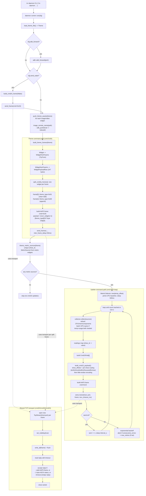

```mermaid
flowchart TD
    A["trv daemon CLI (`trv daemon ...`)"]
    B["daemon::runner::run(cfg)"]
    C["load_theme_file() -> Theme"]
    A --> B --> C
    C --> D{"cfg.adb_forward?"}
    D -- yes --> D1["adb::adb_forward(port)"]
    D -- no --> E
    D1 --> E
    E{"cfg.send_wake?"}
    E -- yes --> E1["build_cmd24_frame(Wake)"]
    E -- no --> F
    E1 --> E2["send_frame(cmd=0x24)"]
    E2 --> F
    F["push_theme_assets(theme)\nfor each image/video widget:\n- image_remote_name(path)\n- adb_push(local -> /sdcard/<basename>)"]
    F --> G["build_theme_frames(theme)"]
    subgraph THEME["Theme command path (cmd 0x3A)"]
      G --> G1["Widget -> WidgetHexParams (TryFrom)"]
      G1 --> G2["WidgetHexParams -> WidgetPayloadRaw (247 bytes)"]
      G2 --> G3["split_cmd3a_frames(): one widget per frame"]
      G3 --> G4["frame[0]: theme_type=0x01 (clear+add)\nframe[n]: theme_type=0x00 (append)"]
      G4 --> G5["build AAF5 frame cmd=0x3A\npayload = [num_widgets=1][theme_type][247-byte widget]"]
      G5 --> G6["send_frames(..., inter_frame_delay=50ms)"]
    end
    G6 --> H["theme_metric_sources(theme)\nunique (show_id, MetricSource) from metric widgets"]
    H --> I{"any metric sources?"}
    I -- no --> I1["stop (no cmd15 updates)"]
    I -- yes --> J["MetricCollector::new(temp_offset)\nprime CPU baseline; sleep 500ms"]
    subgraph UPDATE["Update command path (cmd 0x15 loop)"]
      J --> K{{loop until count reached or Ctrl-C}}
      K --> K1["collector.collect(sources)\nrefresh CPU/mem/components\nbatch GPU query if temp+usage both needed"]
      K1 --> K2["readings map (show_id -> value)"]
      K2 --> K3["build Cmd15Field[]"]
      K3 --> K4["build_cmd15_payload():\nshow_offsets + per-show scaling\n(tenths/hundredths/thousandths/raw)\nthen little-endian encoding"]
      K4 --> K5["build AAF5 frame cmd=0x15"]
      K5 --> K6["send_frame(host, port, frame, recv_timeout_ms)"]
      K6 --> K7{"send ok?"}
      K7 -- yes --> K8["sent += 1; sleep interval_s"]
      K7 -- no --> K9["exponential backoff\nabort if consecutive_errors > max_retries (if set)"]
      K8 --> K
      K9 --> K
    end
    subgraph TRANSPORT["Shared TCP transport (cmd24/cmd3A/cmd15)"]
      T1["open new TcpStream(host:port) per frame"]
      T2["set_nodelay(true)"]
      T3["write_all(frame) + flush"]
      T4["read reply with timeout"]
      T5["accept reply if:\n- valid AAF5 frame, or\n- 1-byte ASCII status, or\n- timeout (empty reply)"]
      T6["close socket"]
      T1 --> T2 --> T3 --> T4 --> T5 --> T6
    end
    E2 -. "uses transport" .-> T1
    G6 -. "uses transport per split frame" .-> T1
    K6 -. "uses transport" .-> T1
```