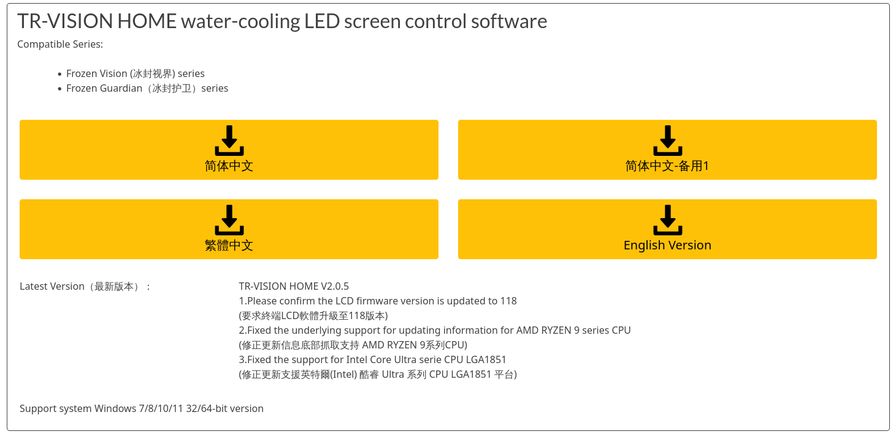
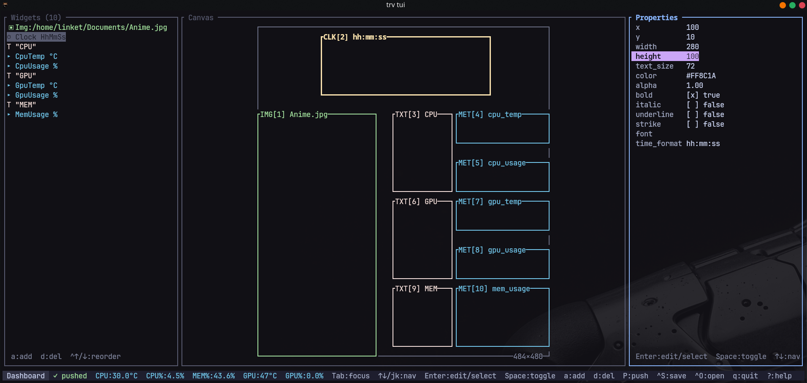
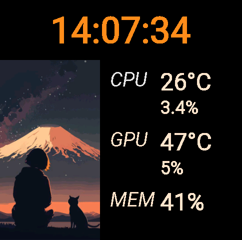

# trv

`trv` is a Rust toolset for the Thermalright/Frozen Vision LCD display.

- `trv tui` — interactive theme editor (Ratatui UI)
- `trv daemon` — pushes a theme and streams live metrics to the device
- `trv list` / `trv export` — preset helpers

## Screenshots

TR-VISION HOME software reference page:

[https://www.thermalright.com/support/download/](https://www.thermalright.com/support/download/)



`trv tui` editor:



Example LCD output on device:



## Platform support

Current installer support is **Arch Linux / CachyOS only**.

## Requirements

At runtime/build time you need:

- Linux (Arch or CachyOS)
- `git`
- `base-devel`
- `rustup` (Rust toolchain)
- `android-tools` (`adb`)
- `systemd`

Rust requirement:

- `rustc >= 1.88` (project edition is Rust 2024)

The install script installs all required packages automatically.

## Install or Update (one-liner)

```bash
curl -fsSL https://raw.githubusercontent.com/LinkeTh/trv/main/install.sh | bash
```

What this does:

1. Validates Arch/CachyOS
2. Installs dependencies with `pacman`
3. Installs/updates Rust stable via `rustup`
4. Clones/updates the repo to `~/.local/share/trv/src`
5. Builds `trv` in release mode
6. Installs binary to `~/.local/bin/trv`
7. Installs and enables user service `trv-daemon.service`

Service unit location:

- `~/.config/systemd/user/trv-daemon.service`

## Uninstall

```bash
curl -fsSL https://raw.githubusercontent.com/LinkeTh/trv/main/uninstall.sh | bash
```

This removes:

- user service `trv-daemon.service`
- installed binary `~/.local/bin/trv`
- source checkout under `~/.local/share/trv/src`
- PATH block inserted by `install.sh`

## Manual build (without installer)

```bash
git clone https://github.com/LinkeTh/trv.git
cd trv
cargo build --release
./target/release/trv --help
```

## First run

```bash
trv tui
```

Try presets:

```bash
trv list
trv tui --preset all_metrics
trv tui --preset video
```

Note: device-side theme activation can lag by up to ~10 seconds after push.

Theme selection behavior:

- `--theme` overrides everything
- otherwise `trv` reads `~/.config/trv/config.toml` (`theme = "..."`)
- if config has no valid theme, `~/.config/trv/themes/dashboard.toml` is created/used

After a successful push from TUI, the active theme path is saved as default in:

- `~/.config/trv/config.toml`

So both `trv tui` and `trv daemon` stay on the same theme by default.

## Video widget compatibility

Video widgets are supported, but playback depends on the device decoder.

- Prefer H.264 + `yuv420p`
- Use lower resolution (for example 960x540)
- Remove audio for maximum compatibility

If a video does not play on the device, transcode it first:

```bash
ffmpeg -i input.mp4 \
  -vf "scale=960:-2:flags=lanczos" \
  -c:v libx264 -profile:v baseline -level 3.1 -pix_fmt yuv420p \
  -an -movflags +faststart \
  output_trv.mp4
```

## User service commands

```bash
systemctl --user status trv-daemon.service
systemctl --user restart trv-daemon.service
systemctl --user stop trv-daemon.service
systemctl --user disable trv-daemon.service
```

## Keybinds

- Full command usage and keybindings are in `USAGE.md`.

## License

MIT — see `LICENSE`.
